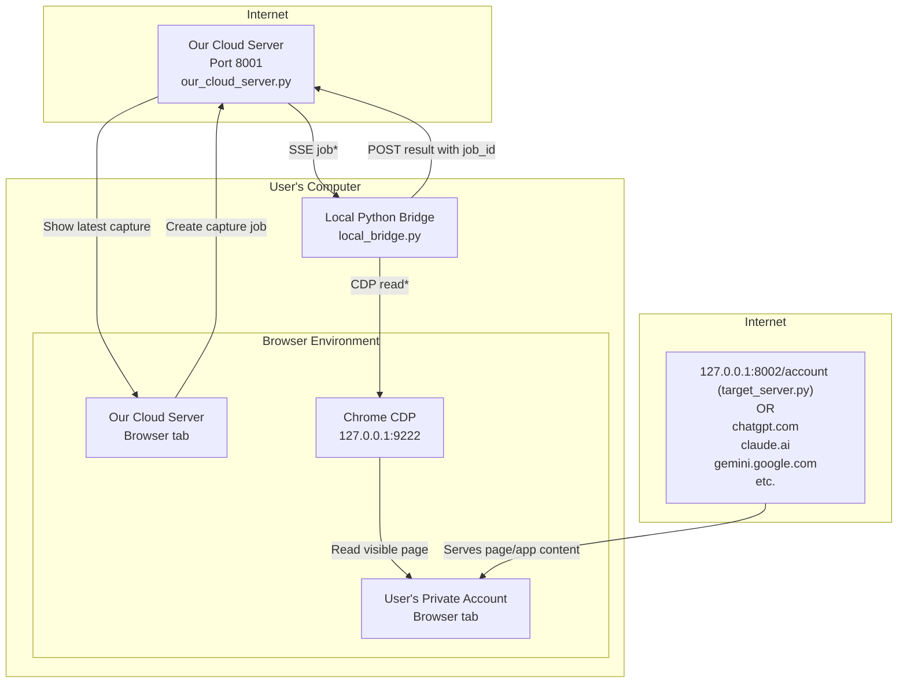

# Share and Sell Software: A New Way to Deploy Software to Beat the Giants

Software deployment has changed many times.

In the early personal-computer era, software was copied from disks and installed directly onto one machine. Later, software was shipped on CDs and DVDs, then downloaded from websites as installers, then managed through package managers, app stores, browser extensions, cloud services, mobile app stores, and software-as-a-service accounts.

Each step reduced some kinds of friction. Users no longer expect to wait for a disk in the post. They expect to click a link, sign in, and start using software immediately.

For many products, the web has become the default deployment platform. A web app can be updated instantly, used from many devices, and sold through a subscription account. This has made software easier to share and sell.

But there is still a major gap.

Many valuable software tasks need access to the user’s real working environment: local files, desktop applications, browser tabs, logged-in web sessions, Office documents, scanners, legacy software, private archives, and accounts on other platforms.

The largest technology companies can often bridge these gaps because they control major platforms. They may own the browser, the operating system, the app store, the cloud account, the identity layer, the office suite, or the APIs that other products depend on. That position lets them create software experiences that feel instant, integrated, and trusted.

Smaller software providers usually do not have that advantage. A small provider can build a useful web app, but the web app may not be able to safely reach the user’s local computer, private browser sessions, documents, or other accounts. A small provider can build a desktop tool, but then deployment becomes harder: downloads, installers, warnings, updates, permissions, support calls, and trust concerns all get in the way.

This proof of concept explores a different pattern.

The user runs a trusted **Local Python Bridge** on their own computer. **Our Cloud Server** provides the web account, user interface, job orchestration, storage, permissions, billing, and audit trail. Our cloud server can ask for work to be done, but the Local Python Bridge decides what it is willing to do locally.

In this demo, our cloud server creates a constrained capture job. The Local Python Bridge receives the job, checks its local policy, uses Chrome DevTools Protocol to read visible text from an allowed browser tab, and posts the result back to our cloud server.

The aim is not to give our cloud server unrestricted control of the user’s browser or computer. The aim is to create a controlled deployment pattern where useful local capabilities can be shared, sold, inspected, permissioned, and managed through a web account.

In short:

> Web apps are easy to deploy, but limited in what they can safely reach.
> Local tools can reach the user’s real working environment, but are harder to deploy and trust.
> The Local Python Bridge pattern is an attempt to combine the best parts of both.


## Overview

|  |  |
|---|---|
| <a id="overview-row-01"></a>[[link]](#section-01-what-this-demo-shows)**What this demo shows** | A short plain-English overview: our cloud server sends a constrained capture request to a local Python "bridge", which captures text from an already-open browser page via local Chrome DevTools Protocol (CDP) and posts the result back. |
| <a id="overview-row-02"></a>[[link]](#section-02-why-this-matters)**Why this matters** | Explain the key idea: our cloud server does not get cookies, passwords, browser profile files, or raw CDP access. The local Python bridge enforces policy. |
| <a id="overview-row-03"></a>[[link]](#section-03-architecture-at-a-glance)**Architecture at a glance** | Diagram and timeline showing: Our Cloud UI → Our Cloud Server → SSE → Local Python Bridge → Chrome CDP → Target Page → POST result back to Our Cloud Server. |
| <a id="overview-row-04"></a>[[link]](#section-04-demo-components)**Demo components** | Table of files and roles: main.py, our_cloud_server.py, target_server.py, local_bridge.py, cdp_tools.py, multi_command_pane_runner.py. |
| <a id="overview-row-05"></a>[[link]](#section-05-prerequisites)**Prerequisites** | List required software: Python 3, Chrome/Chromium/Edge, terminal/command prompt, demo source files, local loopback access, and available ports. |
| <a id="overview-row-06"></a>[[link]](#section-06-installing-python-on-windows)**Installing Python on Windows** | Step-by-step with screenshots: open Microsoft Store, install Python Install Manager, install Python 3, and verify with python --version. |
| <a id="overview-row-07"></a>[[link]](#section-07-python-on-macos-linux-wsl)**Python on macOS / Linux / WSL** | Explain that macOS/Linux may already have python3; show python3 --version; include install hints if missing. |
| <a id="overview-row-08"></a>[[link]](#section-08-how-this-proof-of-concept-will-be-deployed)**How this proof of concept will be deployed** | Explains that the POC is shared as a .zip and walked through on a setup call because deployment friction is the problem the product is designed to reduce. |
| <a id="overview-row-09"></a>[[link]](#section-09-how-to-run-the-demo)**How to run the demo** | Unzip the source-code folder, confirm Python and Chrome are available, open a terminal, and run python main.py or python3 main.py. |
| <a id="overview-row-10"></a>[[link]](#section-10-what-should-happen-when-it-starts)**What should happen when it starts** | Show expected terminal panes and log messages: our cloud server, target server, local Python bridge, CDP browser ready, SSE connected. |
| <a id="overview-row-11"></a>[[link]](#section-11-the-cloud-page)**Our Cloud Server UI Page** | Screenshot and explanation of http://127.0.0.1:8001/: capture button, dropdown, local Python bridge status, latest capture, raw JSON results. |
| <a id="overview-row-12"></a>[[link]](#section-12-the-target-website)**The target website** | Screenshots of http://127.0.0.1:8002/, /login, and /account; explain the demo login cookie and textarea. |
| <a id="overview-row-13"></a>[[link]](#section-13-running-a-capture-job)**Running a capture job** | Step-by-step: select prefix, click capture, job created, local Python bridge receives SSE job, local Python bridge captures target page, result appears. |
| <a id="overview-row-14"></a>[[link]](#section-14-understanding-the-result)**Understanding the result** | Explain friendly latest capture table: Received, Job, Status, Captured URL, Title. Then explain raw JSON fields. |
| <a id="overview-row-15"></a>[[link]](#section-15-security-and-trust-boundary)**Security and trust boundary** | Explains the trust boundary: our cloud server requests; local bridge decides; configured prefixes limit scope; no raw CDP commands, cookies, passwords, or browser profile files are given to the server. Also introduces AI-assisted review as a practical way to inspect the local bridge code. |
| <a id="overview-row-16"></a>[[link]](#section-16-limitations-of-this-poc)**Limitations of this POC** | Be honest about the proof-of-concept limits: local-only demo, simple HTTP server, no production authentication, simple permissions, and deliberately narrow capture behaviour. |
| <a id="overview-row-17"></a>[[link]](#section-17-next-steps-production-direction)**Next steps / production direction** | Explain possible evolution: signed local Python bridge, user account, explicit permissions, richer capture types, packaged installer, real cloud deployment, tool registry, and audit trail. |

<a id="section-01-what-this-demo-shows"></a>

## [[back]](#overview-row-01) What this demo shows

This demo shows a proof-of-concept software deployment framework in which a user’s web account can coordinate work with a trusted local Python bridge running on the user’s own computer. The web account can create high-level jobs, and the local bridge can carry out those jobs using local capabilities such as browser automation, file access, or local scripts, subject to policy checks in the bridge.

In this demonstration, our cloud server page sends a constrained capture request to the local bridge. The bridge then uses Chrome DevTools Protocol (CDP) on the user’s machine to read visible text from a browser page that the user is already logged into. The captured result is posted back to our cloud server page and displayed there.

The important point is that our cloud server is not directly given browser cookies, passwords, raw browser profile files, or unrestricted CDP access. The local bridge remains the controlled execution point. A future version of this pattern could support tools such as scraping a user’s ChatGPT, Claude, or Gemini sessions and uploading them into a searchable “Googlish” archive, while keeping the sensitive browser/session access local to the user’s machine.

<a id="section-02-why-this-matters"></a>

## [[back]](#overview-row-02) Why this matters

This pattern could become a deployment model for trusted local tools. Instead of installing a separate desktop application for every product feature, the user installs and runs one local Python bridge. That bridge becomes the trusted local execution point on the user’s computer.

The user’s web account then provides the product layer around that bridge: the interface, job orchestration, storage, search, billing, permissions, audit history, and feature configuration. In other words, the website becomes the control plane, while the Python bridge becomes the local worker.

This matters because many valuable tasks require access to things that are difficult or impossible for a normal cloud service to reach directly: local files, desktop applications, browser tabs, logged-in web sessions, legacy software, scanners, Office documents, or private data stored on the user’s machine. The bridge can access those things locally, while the web account gives the user a convenient place to start jobs, review results, search captured material, and manage what tools are allowed to run.

This also creates a practical route for small software providers to offer integrations that are normally reserved for much larger platforms. Large companies can integrate across apps, websites, accounts, and devices because they control major software platforms, have privileged APIs, and already occupy a trusted position with the user. A local bridge offers a different route. It creates a user-authorised integration surface across local files, desktop applications, browser tabs, and logged-in web sessions, without requiring our cloud server to own the browser, the operating system, or the third-party platforms being accessed.

The sensitive access happens locally, under the control of the bridge. Our cloud server account provides the product experience around it: the user interface, configuration, permissions, storage, search, billing, and audit trail.

In this demo, the tool is deliberately simple: our cloud server page asks the local bridge to capture visible text from an allowed browser page. But the same deployment pattern could support many other tools, such as archiving ChatGPT, Claude, or Gemini sessions; processing local Word documents; extracting data from legacy applications; or building searchable personal archives.

The key idea is simple: one trusted local bridge, many cloud-managed tools.

<a id="section-03-architecture-at-a-glance"></a>

<a id="architecture-at-a-glance"></a>

## [[back]](#overview-row-03) Architecture at a glance



<a id="architecture-link-sse-job"></a>
[[link]](#footnote-sse-job) SSE job*

<a id="architecture-link-cdp-read"></a>
[[link]](#footnote-cdp-read) CDP read*

### Timeline: how the demo works

1. The user opens **Our Cloud Server UI — Browser tab** on the user’s computer.
2. The user clicks **Create capture job**.
3. **Our Cloud Server UI — Browser tab** sends **Create capture job** to **Our Cloud Server — `our_cloud_server.py`**.
4. **Our Cloud Server — `our_cloud_server.py`** sends an **SSE job*** to **Local Python Bridge — `local_bridge.py`**.
5. **Local Python Bridge — `local_bridge.py`** checks the job against its local policy.
6. **Local Python Bridge — `local_bridge.py`** sends a **CDP read*** request to **Chrome CDP — `127.0.0.1:9222`**.
7. **Chrome CDP — `127.0.0.1:9222`** performs **Read visible page** against **User’s Private Account — Browser tab**.
8. **Internet** servers serve the private account page content, for example `127.0.0.1:8002/account (target_server.py)`, `chatgpt.com`, `claude.ai`, `gemini.google.com`, etc.
9. **Local Python Bridge — `local_bridge.py`** sends **POST result with `job_id`** to **Our Cloud Server — `our_cloud_server.py`**.
10. **Our Cloud Server — `our_cloud_server.py`** updates **Our Cloud Server UI — Browser tab** to **Show latest capture**.

<a id="section-04-demo-components"></a>

## [[back]](#overview-row-04) Demo components

This proof of concept is deliberately split into a small number of simple Python files. Each file has a clear role, so the moving parts can be understood separately.

| File                           | Role                                                                                                                                                                                                                                                                                       |
| ------------------------------ | ------------------------------------------------------------------------------------------------------------------------------------------------------------------------------------------------------------------------------------------------------------------------------------------ |
| `main.py`                      | Starts the demo. It launches the required local services, starts Chrome with CDP enabled, and opens the terminal panes so the user can see what is happening.                                                                                                                              |
| `our_cloud_server.py`              | Provides the demo “cloud” web interface and job server. In the POC it runs locally on port `8001`, but conceptually it represents our cloud server with a user’s account. It serves the browser UI, creates jobs, streams jobs to the local Python bridge using SSE, and receives posted results. |
| `target_server.py`             | Provides a fake target website for safe testing. In the POC it runs locally on port `8002` and simulates a logged-in private account page that the local Python bridge can capture from.                                                                                                                |
| `local_bridge.py`              | The local Python bridge. It connects to the server, waits for jobs, checks whether a requested capture is allowed, talks to Chrome through CDP, reads limited page content, and posts the result back.                                                                                     |
| `cdp_tools.py`                 | Contains the lower-level Chrome/CDP helper code. It is responsible for launching or finding Chrome with a debugging port and sending simple CDP commands.                                                                                                                                  |
| `multi_command_pane_runner.py` | Runs multiple commands in one terminal-style view so the demo can show our cloud server, target server, local Python bridge, and other processes at the same time.                                                                                                                                      |

The important separation is between the **server-side orchestration** and the **local execution point**. The server can create high-level jobs, but the local Python bridge decides what it will actually do. The local Python bridge is where the local policy checks live.

In this POC, the demo server and target server both run on `127.0.0.1` to keep everything self-contained and easy to inspect. In a production version, `our_cloud_server.py` would be replaced by a real hosted web service, while the local Python bridge would still run on the user’s own computer.

<a id="section-05-prerequisites"></a>

## [[back]](#overview-row-05) Prerequisites

Before running the demo, the machine needs a few basic pieces of software.

| Requirement                         | Why it is needed                                                                                                               |
| ----------------------------------- | ------------------------------------------------------------------------------------------------------------------------------ |
| Python 3                            | The demo is written in Python. The servers, local Python bridge, CDP tooling, and process runner are all Python scripts.                    |
| Chrome, Chromium, or Edge           | The demo uses Chrome DevTools Protocol, so it needs a Chromium-based browser that can be started with a remote debugging port. |
| Terminal / command prompt           | The demo is started from a terminal so the user can see the server, local Python bridge, and browser automation logs.                       |
| Demo source files                   | The Python files must be in the same project folder so `main.py` can start the pieces correctly.                               |
| Local network access to `127.0.0.1` | The POC uses local ports such as `8001`, `8002`, and `9222`. These are loopback addresses on the user’s own machine.           |
| Ports available                     | Ports `8001`, `8002`, and `9222` should not already be occupied by stale demo processes or another application.                |

For the easiest first run, use a normal desktop operating system such as Windows, macOS, or Linux with Chrome installed. The demo is easiest to understand when the browser window and the terminal panes are visible side by side.

The POC does not require a real cloud account, a public web server, or real credentials for ChatGPT, Claude, or Gemini. The included `target_server.py` provides a safe local target page so the capture workflow can be tested without touching a real private account.

<a id="section-06-installing-python-on-windows"></a>


## [[back]](#overview-row-06) Installing Python on Windows

For this demo, the easiest way to install Python on Windows is through the **Microsoft Store**. This is a simple approach for non-technical users because the Store handles the download and installation for you.

### Step 1 — Open the Microsoft Store

Open the **Microsoft Store** from the Start menu or taskbar.


If you do not already see it pinned, open the Start menu and search for **Microsoft Store**.

### Step 2 — Search for Python

In the Microsoft Store search box, search for **Python**.

For this guide, use **Python Install Manager** published by the **Python Software Foundation**.


This Store entry provides the official Python installation experience for Windows.

### Step 3 — Open or install Python Install Manager

- If the page shows an **Install** button, click **Install**.
- If the page shows an **Open** button, Python Install Manager is already installed, and you can click **Open**.

### Step 4 — Install a Python 3 version

Once Python Install Manager opens, choose a current **Python 3** release and install it.

If more than one option is shown, choose a normal current Python 3 version rather than an experimental or specialised build.

### Step 5 — Open Command Prompt or PowerShell

After installation completes, open a new **Command Prompt** or **PowerShell** window.

### Step 6 — Check that Python is installed

Run:

```powershell
python --version
```

You should see a Python 3 version number, for example:

```text
Python 3.12.x
```

<a id="section-07-python-on-macos-linux-wsl"></a>

## [[back]](#overview-row-07) Python on macOS / Linux / WSL

On macOS, Linux, or WSL, Python may already be installed. The command is often `python3` rather than `python`.

Check the installed version:

```bash
python3 --version
```

If Python is installed, you should see a Python 3 version number.

For this demo, no extra Python packages need to be installed. The demo uses Python’s built-in standard library.

If Python is missing, install it using the normal package manager for the system.

On macOS, Python can be installed using the official Python installer or Homebrew:

```bash
brew install python
```

On Debian, Ubuntu, or WSL Ubuntu:

```bash
sudo apt update
sudo apt install python3
```

On Fedora:

```bash
sudo dnf install python3
```

On Arch Linux:

```bash
sudo pacman -S python
```

On macOS and Linux, the browser executable may be called `google-chrome`, `chromium`, `chromium-browser`, or it may live inside the standard Applications folder. The CDP launcher code may need to know where the browser is installed if it cannot find it automatically.

For this demo, the key thing is that Python can run the scripts, and Chrome or another Chromium-based browser can be started with a local debugging port.

<a id="section-08-how-this-proof-of-concept-will-be-deployed"></a>

## [[back]](#overview-row-08) How this proof of concept will be deployed

For this proof of concept, the demo will be shared as a `.zip` file containing the source code and this guide.

I will take you through the deployment on a Google Meet, Zoom, or Telegram call. The purpose of that call is not just to get the demo running. It is also to show, very directly, where the friction is in ordinary software deployment.

Deploying software is often one of the biggest sources of hassle in the software business. A user may need to download files, unzip folders, install dependencies, find the right version of Python, deal with browser permissions, run commands in a terminal, understand error messages, and work out whether a failure is caused by their machine, their network, the software, or the instructions.

That friction is not incidental to this project. It is exactly the problem that the product behind this demo is trying to address.

The proof of concept is deliberately visible and inspectable. You can see the Python files, read the local bridge code, and understand the trust boundary. But the intended product direction is different: the user should not have to manage lots of separate software deployments by hand. Instead, the user would run one trusted local bridge, and their web account would manage the tools, permissions, jobs, results, updates, storage, and product experience around that bridge.

In other words, this demo is distributed as source code so the idea can be inspected. The product behind the demo is about making this kind of deployment smoother, safer, and less repetitive.

For this reason, the guided setup call is part of the demonstration. It shows both the current proof of concept and the larger product opportunity: reducing the friction between a useful cloud-managed tool and the local computer where the work actually needs to happen.

During the guided setup, I can also show how the local Python files can be inspected before they are run. Because the proof of concept is distributed as readable source code, the bridge can be opened in a text editor or pasted into AI tools such as ChatGPT, Claude, Gemini, or similar coding assistants for a plain-English explanation and safety check. This is not a replacement for formal security review, but it is part of the product philosophy: local tools should be easier to inspect, explain, and trust.

<a id="section-09-how-to-run-the-demo"></a>

## [[back]](#overview-row-09) How to run the demo

The demo will be run from the unzipped source-code folder during the guided setup call.

At a high level, the process is:

1. Unzip the demo folder.
2. Confirm that Python 3 is available.
3. Confirm that Chrome, Chromium, or Edge is available.
4. Open a terminal in the demo folder.
5. Run the demo startup script:

```powershell
python main.py
```

On macOS, Linux, or WSL, the command may be:

```bash
python3 main.py
```

The startup script launches the local demo components and opens the browser pages used in the walkthrough.

The exact command may vary slightly depending on the operating system and how Python is installed. During the setup call, I will check this with you and help resolve any local machine issues that appear.

<a id="section-10-what-should-happen-when-it-starts"></a>

## [[back]](#overview-row-10) What should happen when it starts

When the demo starts successfully, you should see two things:

1. A terminal window showing the running demo components.
2. A Chrome browser window with tabs for the demo pages.

The terminal window is split into panes so you can see the main processes running at the same time.


The panes show the main parts of the proof of concept:

| Pane                           | What it shows                                                                                                 |
| ------------------------------ | ------------------------------------------------------------------------------------------------------------- |
| **Our Cloud Server**          | The demo cloud/server process is running on `http://127.0.0.1:8001/`.                                         |
| **User Account + CDP Browser** | The fake private account website is running on `http://127.0.0.1:8002/`, and the account tab has been opened. |
| **Local Python Bridge**        | The local bridge is running, has reported its capabilities, and has connected to the server’s SSE stream.     |

The important success signs are:

* `Our cloud server running at http://127.0.0.1:8001/`
* `User's Private Account website running at http://127.0.0.1:8002/`
* `Our Cloud Server UI tab already open`
* `User's Private Account tab already open`
* `reported local Python bridge capabilities`
* `opening SSE stream`
* `connected to SSE stream`

You do not need to understand every line in the terminal output. The key point is that the three parts are alive:

1. the server,
2. the target/private account page,
3. the local Python bridge.

At this point, the browser should also have tabs open for **Our Cloud Server UI** and **User’s Private Account**.

<a id="section-11-the-cloud-page"></a>

## [[back]](#overview-row-11) Our Cloud Server UI Page

The browser page served by **Our Cloud Server**.

In this proof of concept, it runs locally at:

```text
http://127.0.0.1:8001/
```

Conceptually, this page represents the user’s web account. In a production version, this would be a real hosted website. In the POC, it is local so the whole system can be inspected and demonstrated safely.

Before a capture has been run, the page looks like this:


The important parts are:

| UI element                            | What it does                                                                                    |
| ------------------------------------- | ----------------------------------------------------------------------------------------------- |
| **Create capture job**                | Creates a high-level capture request on the server.                                             |
| **Target dropdown**                   | Chooses which target URL prefix the capture job is asking about.                                |
| **Local Python bridge supports this target** | Shows that the local bridge has reported that it is willing to handle this target.              |
| **Latest capture**                    | Shows the most recent successful capture. Before the first capture, this says `No capture yet.` |
| **Raw results JSON**                  | Shows the raw result objects received by the server. Before the first capture, this is empty.   |
| **Local Python bridge API**                        | Lists the simple HTTP endpoints used by the proof of concept.                                   |

The important point is that the page creates a **job**. It does not directly control Chrome. It does not receive cookies or browser profile files. It asks the local bridge to perform a constrained task, and the bridge decides what it is willing to do.

<a id="section-12-the-target-website"></a>

## [[back]](#overview-row-12) The target website

The target website is the page that the local Python bridge reads through Chrome CDP.

In this proof of concept, the safe local target page is:

```text
http://127.0.0.1:8002/account
```

It represents a private account page that is already open in the user’s browser.


The page contains:

* a private account heading,
* explanatory text saying that the local Python bridge will read the page through CDP.
* a textarea value,

In a real version of this pattern, the target page might be a page from a service such as ChatGPT, Claude, Gemini, or another web account. The key point is that the page is open in the user’s own browser environment.

Our cloud server does not log into this account directly. The local bridge reads from the browser tab on the user’s computer, subject to its local policy.

<a id="section-13-running-a-capture-job"></a>

## [[back]](#overview-row-13) Running a capture job

The capture workflow starts from Our Cloud Server UI page.

At a high level, the workflow is:

1. Open the **Our Cloud Server UI** tab in the browser.
2. Check that the target dropdown is set to the target you want to capture from.
3. Confirm that the page says the local Python bridge supports this target.
4. Click **Create capture job**.
5. The server sends an **SSE job** to the local Python bridge.
6. The local Python bridge checks the job against its local policy.
7. If the job is allowed, the bridge performs a **CDP read** against the matching browser tab.
8. The bridge posts the result back to the server with the `job_id`.
9. The Our Cloud Server UI updates to show the latest capture.

The important thing is that the server creates a high-level job, but the local bridge performs the sensitive local work.

The job is not:

```text
"Give the server raw control of my browser."
```

It is closer to:

```text
"Ask my local bridge whether it is willing to capture visible text from an allowed browser page."
```

That distinction is the core of the proof of concept.

<a id="section-14-understanding-the-result"></a>

## [[back]](#overview-row-14) Understanding the result

After a successful capture, Our Cloud Server UI updates to show the result.


The result is shown in two forms:

1. a friendly summary for humans,
2. the raw JSON result for inspection.

### Latest capture

The **Latest capture** table gives a compact summary.

| Field            | Meaning                                                    |
| ---------------- | ---------------------------------------------------------- |
| **Received**     | When the server received the result from the local bridge. |
| **Job**          | The job identifier, such as `job_1`.                       |
| **Status**       | Whether the capture succeeded.                             |
| **Captured URL** | The browser page that the local bridge captured from.      |
| **Title**        | The page title reported from the browser tab.              |

This is the human-friendly version of the result.

### Preview

The **Preview** section shows the visible text captured from the browser page.

In the example, this includes text from the user’s private account page:

```text
User's Private Account

Private note: This text is visible only because this browser is logged in.

This is the page the Local Python Bridge will read through CDP, without reading cookies directly.
```

This demonstrates that the bridge read page content from the browser tab.

### Textarea values

The **Textarea values** section shows values captured from editable fields on the page.

For example:

```text
text-editor: Edit this text...
```

This matters because useful account pages often contain textareas, form fields, editors, or other structured areas that may not be captured cleanly by plain visible text alone.

### Raw results JSON

The **Raw results JSON** section shows the full result object posted back by the local bridge.

This is useful for inspection and debugging. It shows details such as:

| JSON field                             | Meaning                                                                           |
| -------------------------------------- | --------------------------------------------------------------------------------- |
| `ok`                                   | Whether the capture succeeded.                                                    |
| `job_id`                               | Which job this result belongs to.                                                 |
| `captured_from_url`                    | The URL of the page that was captured.                                            |
| `captured_title`                       | The browser page title.                                                           |
| `visible_text`                         | The visible text captured from the page.                                          |
| `areas`                                | Additional captured areas, such as textarea values.                               |
| `requested_allowed_url_prefixes`       | The target prefixes requested by the job.                                         |
| `inspected_target_tabs`                | The browser tabs inspected by the local Python bridge while choosing the capture target. |
| `note`                                 | A human-readable explanation of how the capture was selected.                     |
| `local_bridge_allowed_target_prefixes` | The target prefixes the local Python bridge is configured to allow.                      |
| `received_at`                          | When the server received the result.                                              |
| `job_status_before_result`             | The job status before the result was posted back.                                 |

The raw JSON is deliberately visible in the demo. It makes the data flow inspectable and helps show the trust boundary.

The result confirms that the bridge captured page text through local CDP from an allowed browser tab. It also shows that the server received the final result, not raw browser access.


<a id="section-15-security-and-trust-boundary"></a>

## [[back]](#overview-row-15) Security and trust boundary

The security model of this proof of concept is based on a simple separation:

> The cloud side can ask for work to be done, but the local bridge decides what actually happens on the user’s computer.

The browser UI and server create a high-level job. The local Python bridge receives that job, checks it against its local rules, and only then performs a limited action through Chrome CDP.

The important boundary is that **our cloud server is not given direct control of the browser**.

In this demo, the server does not receive:

- the user’s browser cookies,
- the user’s passwords,
- the browser profile files,
- unrestricted CDP access,
- arbitrary browser automation privileges,
- direct access to the user’s local files.

Instead, the server receives the final result that the local bridge chooses to send back.

### What the cloud side can do

The cloud/server side can:

| Capability | Meaning |
|---|---|
| Serve the browser UI | The user interacts with the demo through the web page. |
| Create a capture job | The server creates a high-level request such as “capture from this allowed target prefix”. |
| Send the job over SSE | The server streams the job to the local bridge. |
| Receive the result | The server receives the result posted back by the bridge. |
| Display the result | The server shows the latest capture and raw JSON for inspection. |

### What the local bridge controls

The local bridge controls the sensitive part of the workflow.

It decides:

| Local decision | Why it matters |
|---|---|
| Whether the requested target is allowed | The bridge only handles configured URL prefixes. |
| Which browser tabs are inspected | The bridge selects from tabs visible to local Chrome/CDP. |
| Whether the match is unambiguous | The bridge should avoid guessing when multiple tabs could match. |
| What data is read | The POC reads visible text and textarea values, not cookies. |
| What result is posted back | The server receives the bridge’s result, not raw CDP access. |

This is the core product idea. The website becomes the control plane, but the local bridge remains the trusted execution point on the user’s machine.

### Why this matters

Many useful tasks require access to things that a normal cloud service cannot safely or directly access: browser tabs, logged-in web sessions, local documents, desktop software, scanners, legacy applications, and private data on the user’s computer.

The bridge pattern gives the user a way to authorise local work without handing the cloud service everything.

In a production version, this boundary would need to be made stronger with:

- a signed local Python bridge,
- explicit user permissions,
- clear per-tool capability descriptions,
- a visible audit trail,
- careful update handling,
- narrow local policies,
- revocation controls.

### AI-assisted code review

Because the local bridge runs on the user’s computer, it should be easy for the user, or someone helping the user, to inspect what it does.

One practical safety measure is to encourage users to review the local Python bridge code using AI tools such as ChatGPT, Claude, Gemini, or similar coding assistants. The demo is deliberately shared as ordinary Python source code, rather than as an opaque binary installer, so that the files can be opened, copied, searched, and audited.

A user can ask an AI tool questions such as:

```text
Please review this Python file and explain what it does.
Does it read browser cookies, passwords, or browser profile files?
Does it send data to any server other than the configured demo server?
Does it open network connections? If so, where?
Does it execute downloaded code?
Does it access local files?
Does it use Chrome DevTools Protocol, and what commands does it send?
Summarise any security concerns in plain English.
```

This does not replace professional security review, code signing, sandboxing, or proper production controls. AI tools can make mistakes. However, AI-assisted review can lower the barrier for ordinary users and small organisations to understand what a local Python bridge is doing before they run it.

In a production version, this idea could become part of the deployment process. The bridge could ship with a plain-English capability summary, hashes of important files, a permission manifest, and suggested audit prompts. The goal would be to make the local bridge not only powerful, but also inspectable.

This POC is deliberately small, but the trust boundary is the important idea: **cloud requests; local bridge decides; sensitive access stays local**.

<a id="section-16-limitations-of-this-poc"></a>

## [[back]](#overview-row-16) Limitations of this POC

This is a proof of concept, not a production system.

It is designed to make the architecture visible and inspectable. The goal is to demonstrate the pattern: a web account can coordinate with a trusted local bridge, and the bridge can perform controlled local work.

The current demo has several deliberate limitations.

| Limitation | Meaning |
|---|---|
| Local-only servers | “Our cloud server” and target website run on `127.0.0.1` for the demo. This keeps the system safe and easy to inspect, but it is not a real hosted deployment. |
| Simple HTTP server | The POC uses simple Python server code rather than production web infrastructure. |
| No real user accounts | The demo does not include production login, user management, billing, account settings, or multi-user separation. |
| No production authentication | The bridge/server relationship is simplified for the POC. A production version would need a proper pairing and authorisation process. |
| Simple target policy | The bridge uses configured URL prefixes to decide which targets are allowed. A production version would need richer permission handling. |
| Narrow capture behaviour | The demo captures visible text and textarea values. It does not attempt to capture every possible type of page state or application data. |
| No installer | The demo is shared as source code in a `.zip` file and walked through on a setup call. This is intentionally not the final deployment model. |
| No automatic updates | A production bridge would need a safe update story. |
| No full audit trail | The POC shows raw JSON and logs, but it is not a production audit system. |

These limitations are acceptable for the purpose of the demo. In fact, keeping the POC small makes the trust boundary easier to inspect.

The important thing to evaluate is not whether this is already a finished product. The important thing is whether the architecture is useful:

> one trusted local bridge, many cloud-managed tools.

If the pattern is sound, the production work would be about packaging, signing, permissions, accounts, auditing, updates, and user experience.

<a id="section-17-next-steps-production-direction"></a>

## [[back]](#overview-row-17) Next steps / production direction

The product direction is to turn this proof-of-concept pattern into a smoother deployment and execution model for local tools.

The current demo is intentionally manual. It is shared as source code and run during a guided setup call. That is useful for inspection, but it is not the final experience.

The intended direction is:

> The user runs one trusted local bridge, and the web account manages the tools around it.

Possible next steps include:

| Area | Direction |
|---|---|
| Signed local bridge | Package the bridge as a signed, trusted local application rather than a loose Python script. |
| User account pairing | Pair the local bridge with the user’s web account in a clear, revocable way. |
| Explicit permissions | Show exactly which tools are allowed to access which local capabilities. |
| Tool registry | Let the web account enable different tools that run through the same local bridge. |
| Richer capture types | Support more structured extraction from browser pages, local documents, desktop applications, or legacy systems. |
| Safer policy model | Move from simple URL-prefix rules to clearer user-approved permissions. |
| Audit trail | Record what jobs were requested, what the bridge did, and what results were returned. |
| AI-assisted audit workflow | Provide plain-English capability summaries, file hashes, permission manifests, and suggested AI review prompts so users can inspect the bridge before trusting it. |
| Update mechanism | Provide a safe way to update the bridge and its tool definitions. |
| Better packaging | Reduce the current setup friction with a simpler install/run experience. |
| Real cloud deployment | Replace the local POC server with a real hosted service. |

The larger product opportunity is not just browser capture. The same pattern could support many cloud-managed tools that need local execution:

- archiving ChatGPT, Claude, or Gemini sessions,
- indexing local Word documents,
- extracting data from legacy applications,
- automating browser-based workflows,
- processing local files,
- building searchable personal or business archives,
- integrating with software that has no convenient cloud API.

The key idea remains the same:

> The web account provides the product experience.  
> The local bridge provides controlled access to the user’s computer.

This is why deployment matters so much. Software is often valuable only when it can reach the user’s real working environment. The product behind this demo is about making that reach safer, simpler, and less repetitive.

### Bridge deployment and future skills

A key production question is how new local capabilities should be added. The product should avoid a model where every new skill requires the user to download and run a new Python file. That would recreate the deployment friction this project is trying to remove.

A better direction is to treat the local bridge as a stable trusted runtime. The user installs or runs the bridge once. The bridge then exposes a controlled set of local capabilities to the user’s web account. New tools can be added through cloud-managed skill definitions, permission prompts, and, where necessary, signed local plugin modules.

The safest initial version would keep the bridge mostly self-contained: one trusted bridge with a small set of built-in capabilities. Later versions could support additional plugin files, but only with explicit user approval, versioning, signing, audit logging, and clear permission boundaries.

The goal is not to let the cloud push arbitrary code onto the user’s machine. The goal is to make local tool deployment less repetitive while keeping the user in control of what the bridge is allowed to do.

## Footnotes

<a id="footnote-sse-job"></a>


### [[back]](#architecture-link-sse-job) SSE job*

SSE means **Server-Sent Events**. It is a simple web mechanism where the local Python bridge opens a long-lived HTTP connection to the server, and the server can then stream small messages down that connection. In this demo, the local bridge connects to our cloud server and waits. When the user clicks the capture button in the browser UI, the server writes a small job message onto the SSE stream. The bridge receives that job and decides locally whether it is allowed to act on it.

SSE is one-way: server to client. That is enough here because the bridge only needs to receive job instructions from the server. When the bridge has finished the job, it sends the result back using a normal HTTP `POST`.

The main alternatives would be polling, WebSockets, or a full message queue. Polling would mean the bridge repeatedly asks “is there a job yet?”, which is simple but wasteful and slower. WebSockets allow two-way communication and are more powerful, but they add complexity that this demo does not need. A message queue would be suitable for a larger production system, but it would make the proof of concept harder to understand. SSE was chosen because it is simple, browser/server friendly, easy to debug, and a good fit for “server sends occasional jobs to a waiting local Python bridge”.

<a id="footnote-cdp-read"></a>

### [[back]](#architecture-link-cdp-read) CDP read*

CDP means **Chrome DevTools Protocol**. It is the protocol that developer tools use to inspect and control Chrome. When Chrome is started with a remote debugging port, a local program can connect to that port and ask Chrome about open tabs, page content, the DOM, JavaScript execution, network activity, and other browser state.

In this demo, the local Python bridge uses CDP to read from a browser tab that is already open on the user’s computer. The important word is **read**. The bridge is not taking control of the user’s account, stealing cookies, reading browser profile files, or sending arbitrary browser commands from the cloud. The cloud server sends only a high-level request. The bridge then checks its local policy, selects an allowed tab, and performs a limited read operation against that tab.

This distinction matters because the sensitive access stays local. Our cloud server does not get direct CDP access. It does not get the user’s browser session. It only receives the final result that the local bridge chooses to send back after applying its own rules. In the proof of concept, the read operation captures visible page text and textarea values. In a production version, this read capability would need to be carefully permissioned, audited, and limited to user-approved sites and data types.
